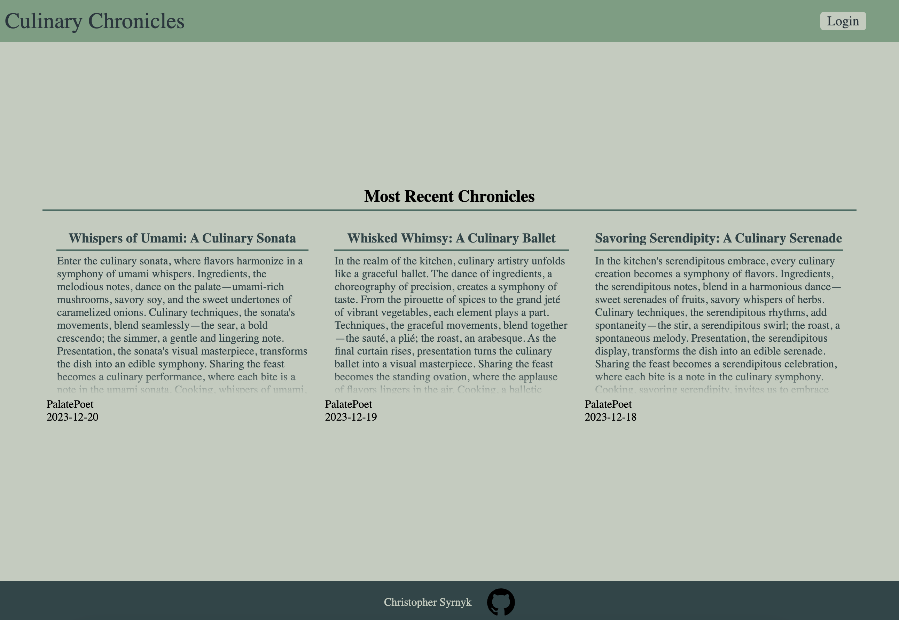

# Blog Project (Front-end)
- Culinary Chronicles is a blogging web application containing culinary poems created by openAI. This is the front end client allowing users to view these culinary poems. Create an account to comment on your favorite culinary poems. 

- [View Project](https://culinary-chronicles.onrender.com)
- [View Backend Code](https://github.com/ChrisSyrnyk/blog-backend)

# Goals
- Create an API only backend allowing for multiple front-end clients. This front-end client allows users to view blogs, create, and delete comments on blog posts. 
- Implementation of REST API's
- Use of JamStack architecture to decouple back-end from front-end
- Utilization of JWT for authentication 

# Built with
- Node/Express (API Backend)
- MongoDB
- JWT authentication
- React.js

# Contact
- [LinkedIn](https://www.linkedin.com/in/christopher-syrnyk-3b5058259/)
- [Portfolio](https://christophersyrnyk.dev)

